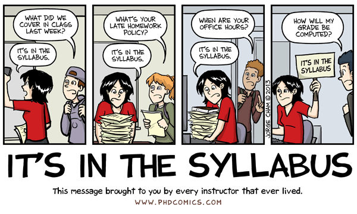

# Course Materials

Most of lecture notes are taken from the following textbook: **Genetics : A Conceptual Approach** *(Benjamin A. Pierce, 4. Edition, 2012)*. In addition, occasionally we'll be referring to **Genetic Analysis & Principles** *(R.J. Brooker, 3. Edition, 2007)* as supplementary source.

Lecture notes are handed in copy center across our department. PDF versions of lecture slides can be downloaded from [AVESIS page](http://avesis.yildiz.edu.tr/alyilmaz/).

Lecture notes contain mostly pics with sparse text, thus you need to listen the instructor and take notes.

In addition to lecture notes, we will be using an online service which simulates *Drosophila* crossings in an interactive manner: [Classical Genetics Simulator](http://cgslab.com/)

\pagebreak

# Grading

Your grade will come from the following sources:

* Midterm: 35%
* Final: 40%
* Quiz: 10%
* Assignment: 10%
* Attendance: 5%

Final exam is from the topics covered after midterm exam.

There will be 3 quizzes and highest 2 scores will be considered. If you attend all lectures or miss only one lecture then you'll get 5 points for attendance. For every 1-2 lectures missed you'll lose 1 point.

Assignment will be 2-3 page paper about *Control of eye color in humans* **OR** *How antibiotic resistance emerges?*. In addition, you'll be doing small writings summarizing the lecture at the end of the lecture. More details regarding assignments will be provided in near future.

# Communication

I'm trying to respond emails as quickly as possible. If you don't get a response within 1-2 days please don't hesitate to send a reminder email.

The changes pertaining to exam date, time and assignment due dates should be decided in class after discussing with everybody. Please don't ask for changes individually, otherwise notification of whole class becomes a hassle.
